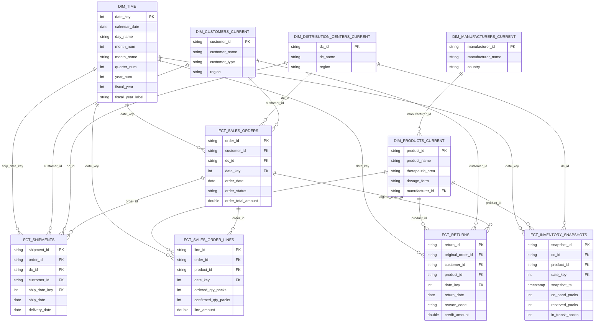
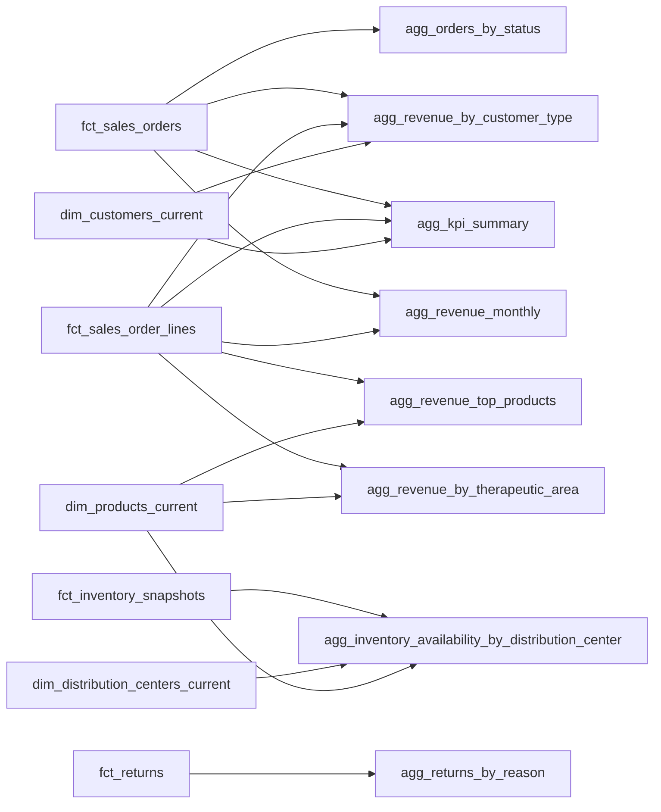

# Databricks Pharma Distribution Analytics

This repository contains a Databricks Asset Bundle for a pharma distribution analytics pipeline built on a Bronze, Silver, and Gold medallion design.

The project ingests a nested JSON landing file, normalizes it into entity-level Silver tables, builds Gold materialized views for analytics, and serves those metrics through a Databricks AI/BI dashboard.

## What This Project Includes

- A serverless Lakeflow Spark Declarative Pipeline managed through Databricks Asset Bundles
- Bronze ingestion for the raw landing dataset
- Silver tables for core business entities
- Gold materialized views for pre-aggregated analytics
- An AI/BI dashboard for KPI and visual reporting

## Project Structure

```text
.
├── bronze_dev/
│   └── landing/
│       └── pharma_distribution_landing.json
├── resources/
│   └── bronze_pharma_pipeline.pipeline.yml
├── src/
│   └── bronze_pharma_pipeline/
│       └── transformations/
│           ├── bronze_pharma_distribution_landing.py
│           ├── silver_*.py
│           └── gold_*.py
├── utilities/
│   ├── data_gen.py
│   └── upload_to_volume.py
└── databricks.yml
```

## Pipeline Configuration

- Bundle name: `bronze_pharma_pipeline`
- Target: `dev`
- Workspace host: `https://dbc-986cc365-9b2e.cloud.databricks.com`
- Catalog: `workspace`
- Base schema: `bronze_dev`
- Pipeline mode: serverless

The pipeline definition is in [resources/bronze_pharma_pipeline.pipeline.yml](/Users/dheerajvatti/databricks_projects/poc_distrbution_analytics/resources/bronze_pharma_pipeline.pipeline.yml), and the bundle configuration is in [databricks.yml](/Users/dheerajvatti/databricks_projects/poc_distrbution_analytics/databricks.yml).

## Data Model

### Bronze

- `workspace.bronze_dev.datawarehouse_raw`

This table stores the raw nested JSON payload with ingestion metadata.

### Silver

These tables flatten and validate the nested business entities:

- `workspace.silver_dev.dim_manufacturers`
- `workspace.silver_dev.dim_manufacturers_current`
- `workspace.silver_dev.dim_products`
- `workspace.silver_dev.dim_products_current`
- `workspace.silver_dev.dim_distribution_centers`
- `workspace.silver_dev.dim_distribution_centers_current`
- `workspace.silver_dev.dim_customers_hist`
- `workspace.silver_dev.dim_customers_current`
- `workspace.silver_dev.dim_time`
- `workspace.silver_dev.fct_sales_orders`
- `workspace.silver_dev.fct_sales_order_lines`
- `workspace.silver_dev.fct_inventory_snapshots`
- `workspace.silver_dev.fct_shipments`
- `workspace.silver_dev.fct_returns`

Common Silver patterns used in this project:

- `inline_outer(...)` for array-of-struct flattening
- `@dp.expect_or_drop(...)` for data quality expectations
- `withWatermark(...).dropDuplicates(...)` for streaming-safe deduplication
- explicit casting and trimming for standardized business columns

Conformed time join keys:

- `fct_sales_orders.date_key` -> `dim_time.date_key`
- `fct_sales_order_lines.date_key` -> `dim_time.date_key`
- `fct_inventory_snapshots.date_key` -> `dim_time.date_key`
- `fct_shipments.ship_date_key` -> `dim_time.date_key`
- `fct_returns.date_key` -> `dim_time.date_key`

### Gold

These materialized views provide pre-aggregated analytics for BI consumption:

- `workspace.gold_dev.agg_kpi_summary`
- `workspace.gold_dev.agg_revenue_monthly`
- `workspace.gold_dev.agg_revenue_by_therapeutic_area`
- `workspace.gold_dev.agg_revenue_by_customer_type`
- `workspace.gold_dev.agg_orders_by_status`
- `workspace.gold_dev.agg_inventory_availability_by_distribution_center`
- `workspace.gold_dev.agg_returns_by_reason`
- `workspace.gold_dev.agg_revenue_top_products`

## Star Schema



Notes:

- current dimensions (`dim_*_current`) are the BI join surfaces.
- historical SCD2 dimensions (`dim_*` / `dim_customers_hist`) support point-in-time analysis.
- conformed time dimension (`dim_time`) provides standard calendar and fiscal attributes for all facts via date_key joins.

### Gold Mart Lineage



## Dashboard

The Databricks AI/BI dashboard built from the Gold layer is available here:

- `https://dbc-986cc365-9b2e.cloud.databricks.com/sql/dashboardsv3/01f131db4d62156db234a46d4aaf0c75`

Dashboard coverage includes:

- KPI counters for revenue, orders, and average order value
- monthly revenue trend
- revenue by therapeutic area
- revenue by customer type
- order status funnel
- returns by reason code
- inventory by distribution center
- top products by revenue

## How To Deploy

Make sure the Databricks CLI is authenticated for the target workspace.

Validate the bundle:

```bash
databricks bundle validate
```

Deploy the bundle:

```bash
databricks bundle deploy --target dev
```

Run the pipeline:

```bash
databricks bundle run --target dev bronze_pharma_pipeline --full-refresh-all
```

## Development Notes

- Transformation files live under [src/bronze_pharma_pipeline/transformations](/Users/dheerajvatti/databricks_projects/poc_distrbution_analytics/src/bronze_pharma_pipeline/transformations)
- The pipeline automatically includes all transformation files via a glob pattern
- Local-only development artifacts are ignored via [.gitignore](/Users/dheerajvatti/databricks_projects/poc_distrbution_analytics/.gitignore)

## Mock Real-Time Sales Orders Stream

Use the streaming mock utility to continuously drop sales-order micro-batch files into the Bronze landing folder watched by Auto Loader.

Run from the repository root:

```bash
python3 utilities/mock_sales_orders_stream.py \
	--seed-file bronze_dev/landing/pharma_distribution_landing.json \
	--output-dir bronze_dev/landing \
	--batches 50 \
	--orders-per-batch 2 \
	--interval-seconds 2
```

What this does:

- writes one JSON file per batch in the same schema expected by Bronze
- emits only `sales_orders` records in each file (other arrays are empty)
- uses realistic DC, customer, and product references from your seed landing file
- creates unique real-time order IDs (`SO-RT-...`) per emitted order

## Next Improvements

- add a GitHub Actions workflow for bundle validation
- add data quality tests and table-level checks for Gold outputs
- add a business glossary for the Silver and Gold tables
- add parameterization for multi-environment deployment

## Integration Checks On Push

This repository includes an integration check workflow that runs on every push:

- workflow: `.github/workflows/integration-warehouse-checks.yml`
- SQL checks: `tests/integration/ri_checks.sql`
- runner: `tests/integration/run_ri_checks.py`

What it validates:

- `databricks bundle validate`
- referential integrity from facts to current dimensions in `silver_dev`

Required GitHub Actions secrets:

- `DATABRICKS_HOST`
- `DATABRICKS_TOKEN`
- `DATABRICKS_WAREHOUSE_ID`